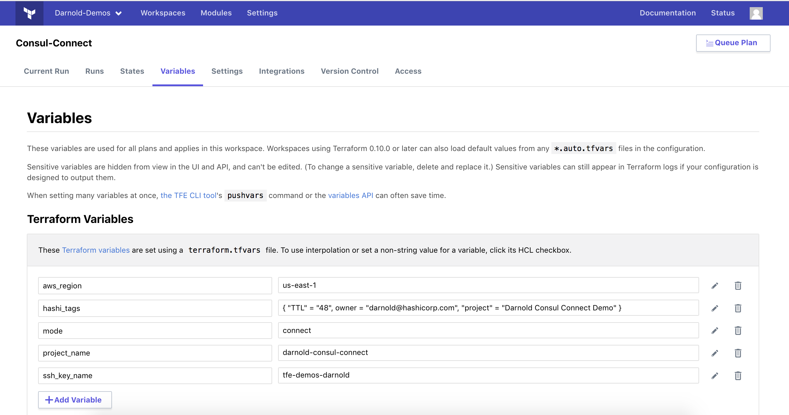

# AWS Consul Connect Demo
## Setup Your Workspaces
This demo uses two sets of AMIs, one for connect enabled and one for connect disabled. In order to save time during your demo, you'll want to have the two workspaces already setup and configured. Possibly even applied, as the demo is not about TFE running and apply; but, rather showing what consul connect can do for setting up cross-service acces controls. 

## Configure your variables
These workspaces will require a few variables to be set. You can see the variables listed below. Also, make sure to have appropriate AWS Environment Variables setup. 

## Configure your working directory
As the terraform code for running the aws demo is found under terraform/aws. Make sure that you set the working directory correctly when setting up the workspace. 

